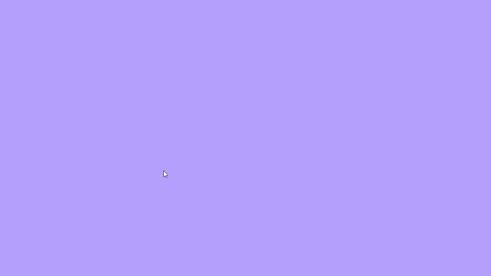
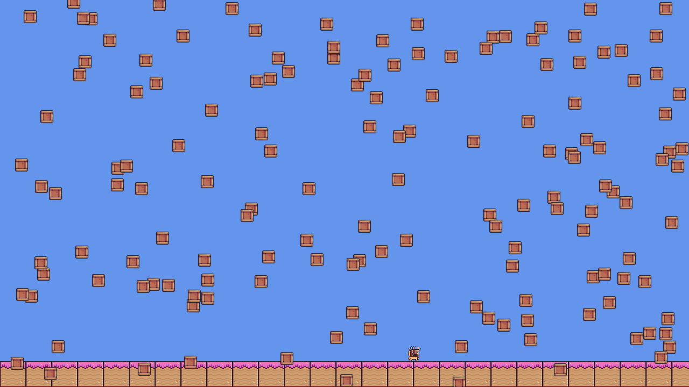

  
  

 

  

# Python-Arcade-Test

## Games

### 01 Basic Window

| Input      | Effect                                                   |
| ---------- | -------------------------------------------------------- |
| 1-3        | Resize & center window                                   |
| Left click | Set random window background color                       |
| Scroll     | Increase/Decrease red channel of window background color |

### 02 Basic Level

| Input      | Effect                              |
| ---------- | ----------------------------------- |
| WASD/Arrow | Move player character               |
| F          | Toggle camera from following player |
| H          | Toggle hitbox visibility            |

## Assets

### Pixel Adventure

https://pixelfrog-assets.itch.io/
